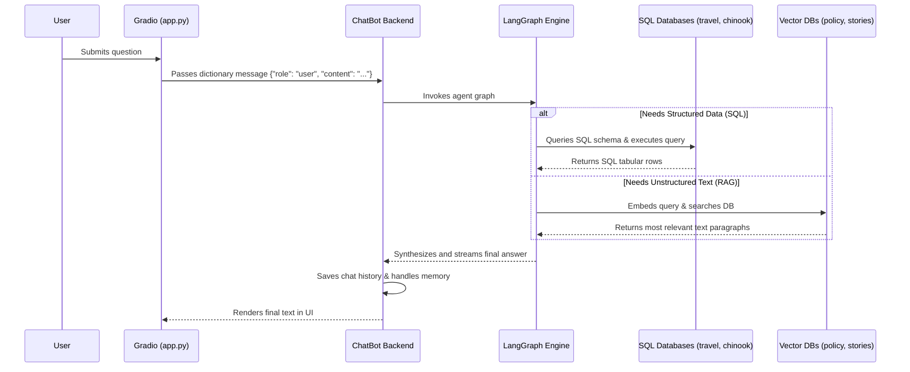
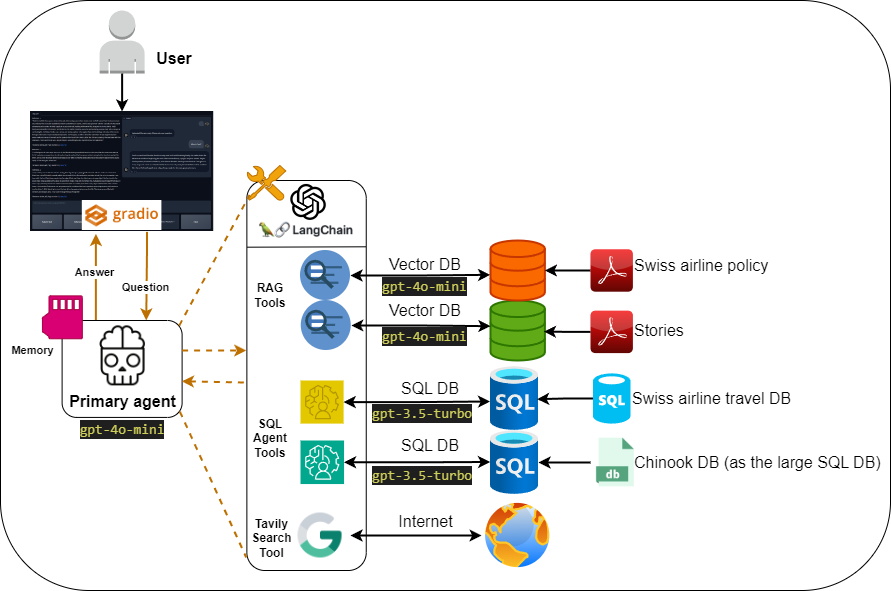
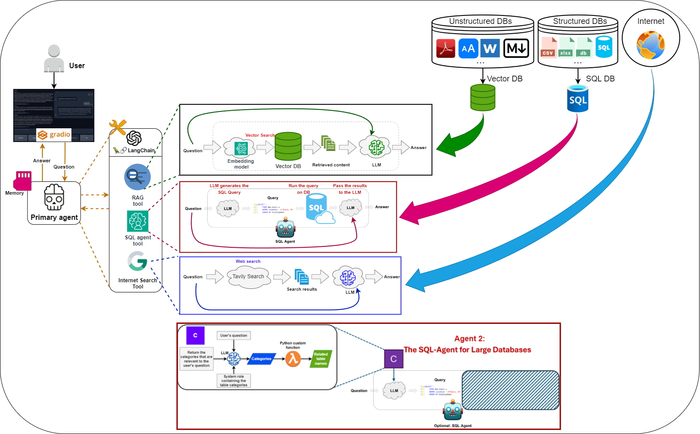
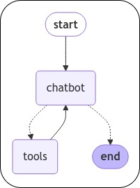
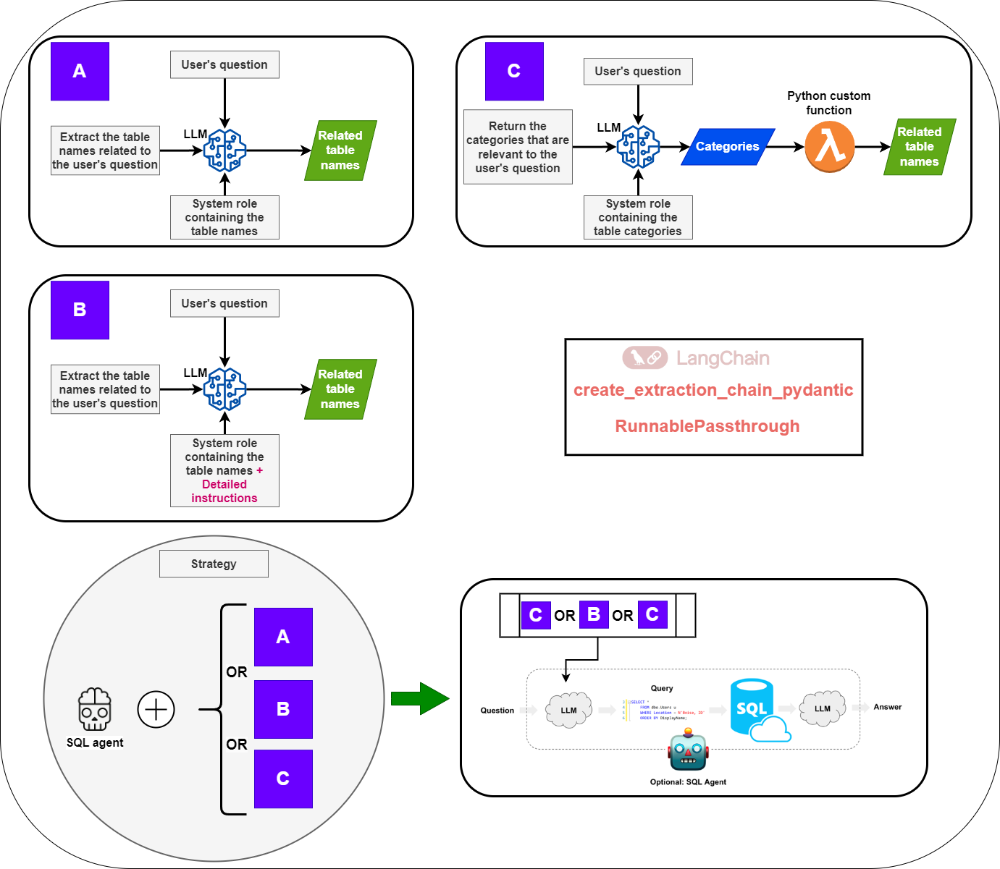
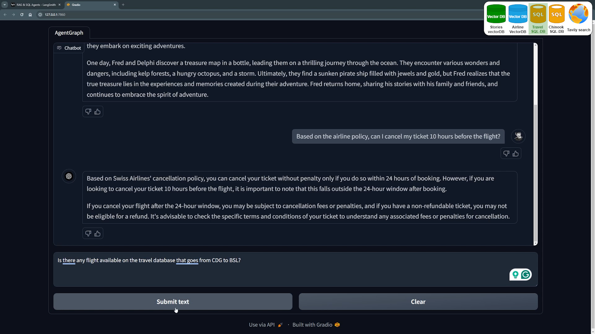
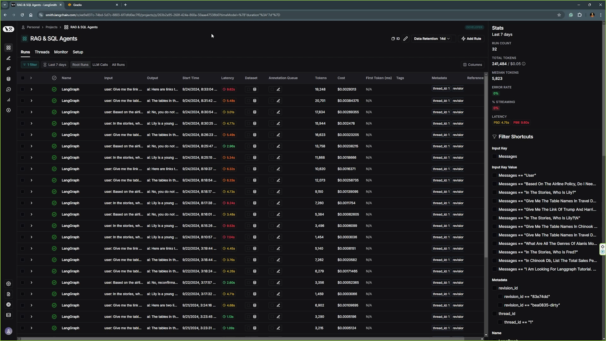

# AgentGraph: Intelligent SQL-agent Q&A and RAG System for Chatting with Multiple Databases

This project demonstrates how to build an agentic system using Large Language Models (LLMs) that can interact with multiple databases and utilize various tools. It highlights the use of SQL agents to efficiently query large databases. The key frameworks used in this project include Google Gemini, LangChain, LangGraph, LangSmith, and Gradio. The end product is an end-to-end chatbot, designed to perform these tasks, with LangSmith used to monitor the performance of the agents.

**Features:**
- Handles unstructured data with RAG and structured data with SQL agents.
- Built-in web search when needed.
- Automatically chooses the best tool for each task.
- Scalable for large databases.
- Easily connects to multiple databases.
- **Dynamic Session Persistence:** Uses Gradio `BrowserState` (cookies) and LangGraph `MemorySaver` to provide fully isolated, persistent chat histories that seamlessly survive page refreshes.
- **Incremental Vector Updates:** The Vector database intelligently checks existing Chroma DB metadata to only embed new PDFs, saving API credits.

---

## Key Notes:
**Key Note 1:** All the project uses Google Gemini models.

**Key Note 2:** When we interact with databases using LLM agents, good informative column names can help the agents to navigate easier through the database.

**Key Note 3:** When we interact with sensitive databases using LLM agents, remember to NOT use the database with WRITE privileges. Use only READ and limit the scope. Otherwise your user can manipulate the data (e.g. ask your chain to delete data).

**Key Note 4:** Familiarity with database query languages such as Pandas for Python, SQL, and Cypher can enhance the user's ability to ask more better questions and have a richer interaction with the graph agent.

---

## General structure of the project:

```text
Project-folder
  ├── README.md           <- The top-level README for developers using this project.
  ├── HELPER.md           <- Contains extra information that might be useful to know for executing the project.
  ├── .env                <- dotenv file for local configuration.
  ├── .here               <- Marker for project root.
  ├── configs             <- Holds yml files for project configs
  ├── Notebooks           <- Contains exploration notebooks and the teaching material for YouTube videos. 
  ├── data                <- Contains the sample data for the project.
  ├── src                 <- Contains the source code(s) for executing the project.
  |   └── utils           <- Contains all the necessary project modules. 
  └── images              <- Contains all the images used in the user interface and the README file. 
```
NOTE: This is the general structure of the project, however there might be small changes due to the specific needs of each project.

---


## Requirements

- **Operating System:** Linux or Windows (Tested on Windows 11 with Python 3.9.11)
- **Google API Key:** Required for Gemini functionality.
- **Tavily Credentials:** Required for search tools (Free from your Tavily profile).
- **LangChain Credentials:** Required for LangSmith (Free from your LangChain profile).
- **Dependencies:** The necessary libraries are provided in `requirements.txt` file.
---

## Installation and Execution

To set up the project, follow these steps:

1. Clone the repository:
   ```bash
   git clone <repo_address>
   ```
2. Install Python and create a virtual environment:
   ```bash
   python -m venv venv
   ```
3. Activate the virtual environment:
   - On Windows:
     ```bash
     venv\Scripts\activate
     ```
   - On Linux/macOS:
     ```bash
     source venv/bin/activate
     ```
4. Install the required dependencies:
   ```bash
   pip install -r requirements.txt
   ```
5. Download the travel sql database from this link and paste it into the `data` folder.

6. Download the chinook SQL database from this link and paste it into the `data` folder.

7. Copy the `.env.example` file to `.env` and fill in your actual API keys for Gemini (`GOOGLE_API_KEY`), Tavily (`TAVILY_API_KEY`), and optionally LangSmith (`LANGCHAIN_API_KEY`).

8. Run `prepare_vector_db.py` module once to prepare both vector databases.
   ```bash
   python src\prepare_vector_db.py
   ```
9. Run the app:
   ```bash
   python src\app.py
   ```
Open the Gradio URL generated in the terminal and start chatting.

*Sample questions are available in `sample_questions.txt`.*

---

### Using Your Own Database

To use your own data:
1. Place your data in the `data` folder.
2. Update the configurations in `tools_config.yml`.
3. Load the configurations in `src\agent_graph\load_tools_config.py`.

For unstructured data using Retrieval-Augmented Generation (RAG):
1. Run the following command with your data directory's configuration:
   ```bash
   python src\prepare_vector_db.py
   ```

All configurations are managed through YAML files in the `configs` folder, loaded by `src\chatbot\load_config.py` and `src\agent_graph\load_tools_config.py`. These modules are used for a clean distribution of configurations throughout the project.

Once your databases are ready, you can either connect the current agents to the databases or create new agents.

---

## Project Schemas & Architecture

This project routes queries seamlessly between relational databases (using SQL toolkits) and vector databases (using RAG). 

### High-level Agent Flow Diagram
The following flowchart illustrates the lifecycle of a user prompt traveling through the AgentGraph system:



> **Note:** For much more detailed execution flows of every single individual database, check out our [Data Flow Diagrams Documentation](data_flow_diagrams.md) and our [Code Architecture Overview](project_architecture.md).

### High-level Overview Diagram

<div align="center">
  
</div>

### Detailed Schema

<div align="center">
  
</div>

### Graph Schema

<div align="center">
  
</div>

### SQL-agent for large databases strategies

<div align="center">
  
</div>

---

## Chatbot User Interface

<div align="center">
  
</div>

---

## LangSmith Monitoring System

<div align="center">
  
</div>

---

## Databases Used

- **Travel SQL Database:** [Kaggle Link](https://www.kaggle.com/code/mpwolke/airlines-sqlite)
- **Chinook SQL Database:** [Sample Database](https://database.guide/2-sample-databases-sqlite/)
- **stories VectorDB**
- **Airline Policy FAQ VectorDB**
---

## Key Frameworks and Libraries

- **LangChain:** [Introduction](https://python.langchain.com/docs/get_started/introduction)
- **LangGraph**
- **LangSmith**
- **Gradio:** [Documentation](https://www.gradio.app/docs/interface)
- **Google Gemini:** [Developer Quickstart](https://ai.google.dev/docs)
- **Tavily Search**
---