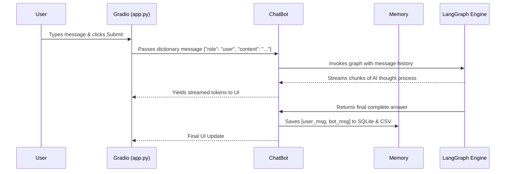
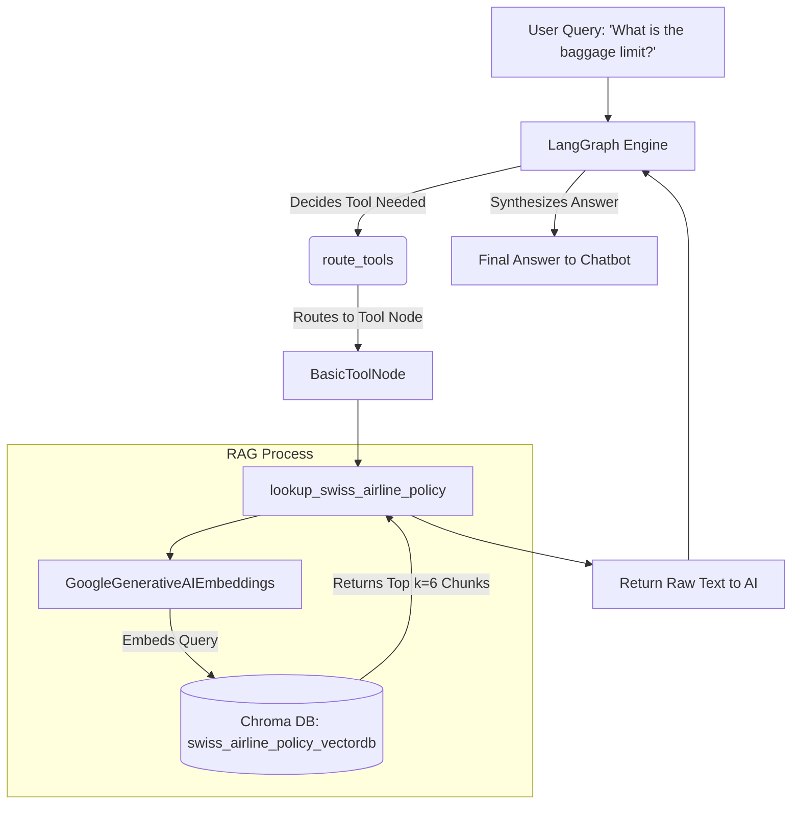
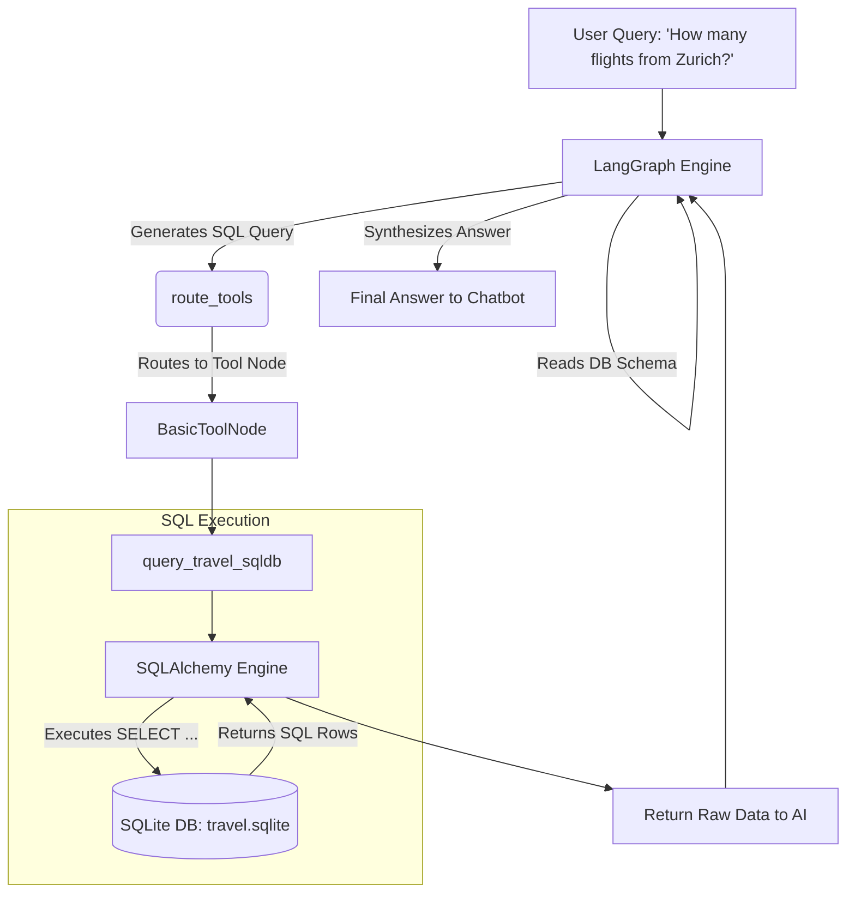
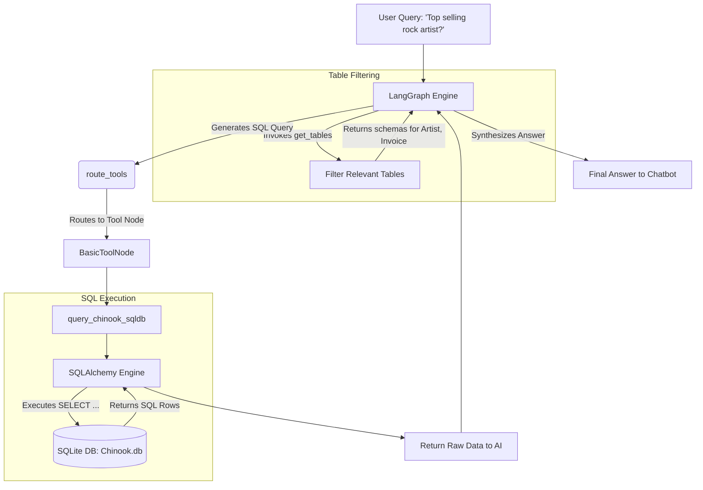
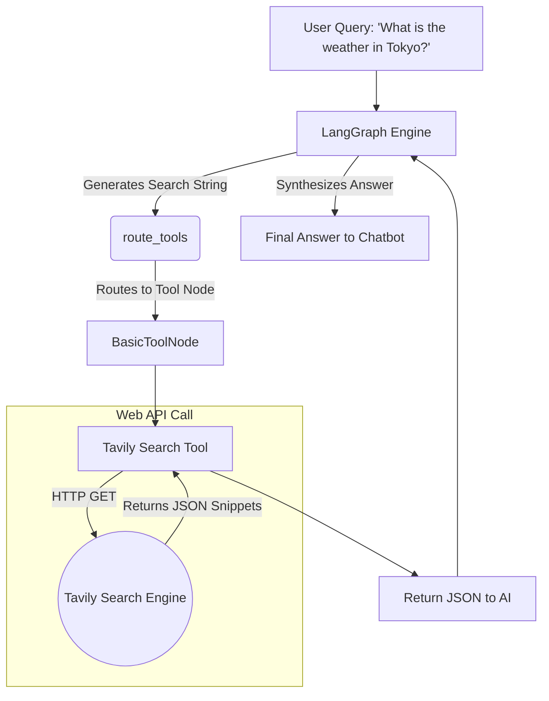

# Detailed Data Flow & Execution Paths

This document illustrates the step-by-step lifecycle of a user prompt traveling through the AgentGraph system, from the moment it is typed in the UI to the moment the final answer is rendered. 

We will trace the execution path for four different types of complex queries, demonstrating how the LLM routes to each of the four primary tools/databases.

---

## 1. The Global Entry & Exit Flow (Applies to all tools)

Regardless of what you ask, every message passes through the same initial UI and memory pipeline before reaching the LangGraph agent.

---

## 2. Execution Path: Vector Database RAG (Stories & Airline Policy)

When the user asks a question about unstructured text (e.g., "What is the baggage limit for Swiss Air?" or "Who is Fred?"), the AI uses a Retrieval-Augmented Generation (RAG) tool.

### Flow Breakdown
1. **Routing**: The AI receives the query, realizes it needs information about airline policies, and decides to invoke the `lookup_swiss_airline_policy` tool.
2. **Execution**: The `BasicToolNode` intercepts the request and fires the `lookup_swiss_airline_policy` function.
3. **Retrieval**: The function connects to the local Chroma DB, converts the AI's search query into an embedding, and retrieves the top `k` most similar paragraphs.
4. **Synthesis**: The retrieved paragraphs are passed back to the AI. The AI reads the paragraphs and synthesizes a final, human-readable answer.

---

## 3. Execution Path: Relational Database (Swiss Airline Travel SQLite)

When the user asks for analytical or specific transactional data (e.g., "How many flights leave from Zurich tomorrow?"), the AI uses a SQL Database tool.

### Flow Breakdown
1. **Routing**: The AI realizes it needs flight data and decides to invoke the `query_travel_sqldb` tool.
2. **Schema Inspection**: LangChain's SQL toolkit automatically provides the AI with the table schemas (`aircrafts_data`, `flights`, etc.) so the AI knows what columns exist.
3. **Query Generation**: The AI generates a raw SQL query string (e.g., `SELECT count(*) FROM flights WHERE...`).
4. **Execution**: The `BasicToolNode` executes the SQL query against the `travel.sqlite` database using an SQLAlchemy engine.
5. **Synthesis**: The raw SQL result (e.g., `[(14,)]`) is returned to the AI. The AI reads the tuple and converts it into a natural language response ("There are 14 flights departing tomorrow").

---

## 4. Execution Path: Dynamic Relational Database (Chinook SQLite)

When the user asks about the music store (e.g., "Which artist sold the most rock albums?"), the AI uses the Chinook SQL tool. Because the Chinook DB has many tables, this tool uses dynamic table filtering.

### Flow Breakdown
1. **Routing**: The AI decides to invoke `query_chinook_sqldb`.
2. **Dynamic Filtering**: The `ChinookSQLAgent` uses the `get_tables()` function to ask the AI *which* tables it actually needs out of the 11 available, preventing the AI from getting confused by irrelevant schemas.
3. **Query Generation**: After looking at the schema for only the requested tables (e.g., `Artist`, `Album`, `Invoice`), the AI writes a complex SQL JOIN query.
4. **Execution**: The query is executed against `Chinook.db`.
5. **Synthesis**: The AI formats the returned data into a final answer.

---

## 5. Execution Path: Live Web Search (Tavily)

When a user asks a question about current events or information not present in any local database, the AI falls back to the internet.

### Flow Breakdown
1. **Routing**: The AI realizes it doesn't have the data locally and decides to invoke the `tavily_search_results_json` tool.
2. **Execution**: The `BasicToolNode` intercepts the request and fires the Tavily API wrapper.
3. **Retrieval**: The tool sends an HTTP request to the Tavily search engine with the AI's search string.
4. **Synthesis**: Tavily returns a JSON array containing snippets and URLs from the top search results. The AI reads the JSON and synthesizes a final answer, often including the source URLs.

